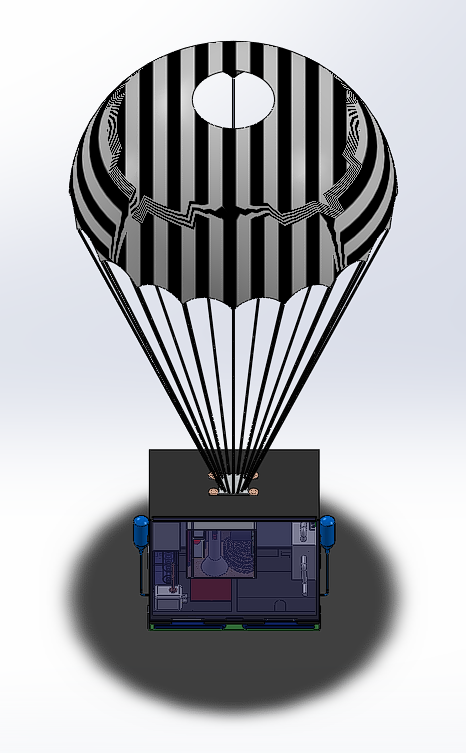
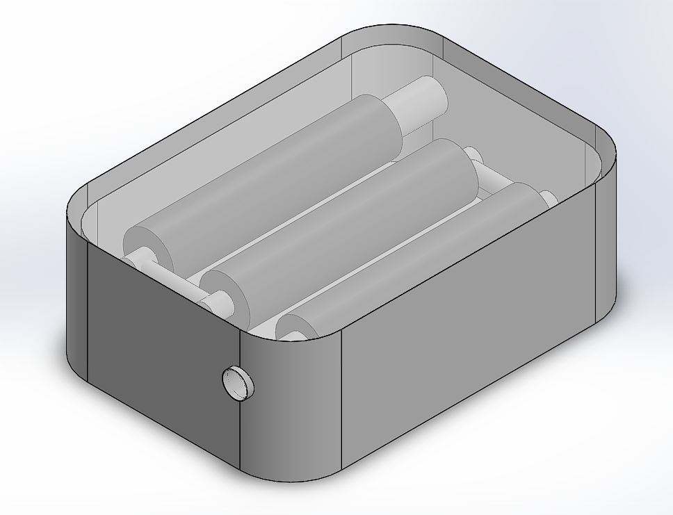

# Smart Modular Workstation for Disaster Relief

Air-droppable, modular field station for disaster response. Submitted to the VYOMA Designathon 2025 (Problem Statement 4), first runner-up.


## Overview

A single droppable unit that gives first responders power, communications, medical supplies, and survival gear in a location with no road access, dropped from an aircraft and slowed down enough to land intact. Designed by a 4-person team (Akula Uday Kiran, Kiran V Airani, Shanthosh K V, Tejas L, RVCE Aerospace Engineering) as a CAD + analysis submission, not a built prototype.

The brief (VYOMA Designathon Problem Statement 4) asked for a deployable disaster-relief package that survives an air drop and is self-sufficient once on the ground. The team's approach: pack everything a stranded group needs for the first 24-48 hours into one housing, size the parachute/airbag system so the drop itself doesn't destroy the payload, and run enough structural analysis to justify that the housing survives worst-case touchdown.



## Module breakdown

The whole thing is split into four modules stacked into one drop-capable housing. Layout below is from the team's own design notes (`docs/modules.txt`), cross-checked against the actual CAD parts in `cad/`.



**Module 1: Power and communication.** LiPo battery pack (3,685-4,914 Wh, ~30.7 kg), Raspberry Pi 5 running an IoT dashboard for power/GPS/occupancy telemetry, a ham radio + antenna for long-range comms (`ham_radio_box.SLDPRT`, `antenna.SLDPRT`, `antenna_base.SLDPRT`), GPS/satellite connectivity (`gps_module.SLDPRT`, `gps_sensor.SLDPRT`) for periodic location pings, and a hand-crank generator (`power_gen_with_crank.SLDPRT`) as backup power. A folding solar panel (`solar panel.SLDPRT`) is also part of this module in the CAD, packed flat and deployed after landing, it isn't called out in the top-level design notes but is modeled and present in the assembly. Estimated endurance at 100 W average draw: 37-49 hours.

**Module 2: Medical and sustenance.** First-aid stock (`First Aid Kit.SLDPRT`), dehydrated food rations (`Food Kit.SLDPRT`), and a water purification unit (dry weight ~2.76 kg, two CAD variants: `Portable Water Filter.SLDPRT` and `Portable Water Filter New.SLDPRT`) for producing potable water in the field. The original design notes also list "waste water to useful" as a goal for this module; the water filter part is the CAD representation of that, there's no separate greywater-recycling geometry beyond it.

**Module 3: Survival kit.** Knife (`knife.SLDASM`), rope (neoprene, 70 g, `rope.SLDPRT`), fire starter, hand warmers (`handwarmers.SLDPRT`), glow sticks, a flare gun (`gun.SLDPRT`), life jackets, masks, and a thermal/IR camera (`ir_camera.SLDPRT`) for locating survivors.

**Module 4: Deployment mechanism.** Parachute + airbag system that handles the actual drop (the design notes describe it as a car-airbag-style mechanism with CO2 cannisters inflating on descent, modeled in CAD as `explicit.SLDPRT`/`explicit.SLDASM` and the `half*`/`modal.SLDASM` casing variants), plus the final assembly housing (`casing.SLDPRT`, `casing_mani.SLDPRT`, `casing_mani1.SLDPRT`, `case.SLDPRT`, `rpi_casing.SLDPRT`, `concrete_base.SLDPRT`, `wheel.SLDPRT`) that packages all three modules above.

All parts are modeled as separate SolidWorks components under `cad/` (`.SLDPRT` / `.SLDASM`), assembled into the final unit shown above.

## Descent and impact analysis

This is the part that's actually engineering, not just packaging. The team had to make sure the workstation survives being dropped from altitude.

**Terminal velocity**, free-fall (no parachute):

```
v_t = sqrt(2mg / (ρ A C_d))
```

with m = 75 kg, ρ = 1.225 kg/m³, A = 0.217 m² (cross-section without parachute), C_d = 0.6:

```
v_t = sqrt(150 / 0.159495) ≈ 30.67 m/s
```

With parachute deployed (A = 1.8237 m² effective canopy area, C_d = 1.75):

```
v_t = sqrt(150 / 3.90955) ≈ 6.19 m/s
```

A CFD simulation of the descent (parachute + payload, velocity field below) came out to ~6 m/s terminal velocity, matching the hand calculation.


**Impact force.** For a 10 m/s touchdown with 0.5 m of airbag stopping distance:

```
a = v² / 2d = 100/1 = 100 m/s²
F = ma = 75 × 100 = 7,500 N
```

The static structural (FEA) runs used a design impact load of 30,000 N (4x the calculated 7,500 N, so factor of safety 4) across three corner-impact cases:

| Case | Max deformation |
|---|---|
| One corner | 0.80 mm |
| Two corners | 1.83 mm |
| All four corners | ~1.0 mm |


All three cases came back within deformation limits, so the housing holds together under the worst-case drop scenario the team modeled.

Full writeup with all module breakdowns, weights, and the complete analysis: [`VYOMA_DESIGNATHON_DOCUMENTATION.pdf`](docs/VYOMA_DESIGNATHON_DOCUMENTATION.pdf). Competition slide deck: [`Vyoma Designathon PPT.pdf`](docs/Vyoma%20Designathon%20PPT.pdf). Descent CFD as a video: [`casing falling cfd.mp4`](docs/casing%20falling%20cfd.mp4). Original team design notes (module list, part placement): [`docs/modules.txt`](docs/modules.txt).

## Repo layout

```
cad/            every component and sub-assembly (.SLDPRT / .SLDASM)
docs/           the two PDF reports, the CFD video, design notes, figures
docs/images/    figures extracted from the report for this README
```

Just CAD plus the reports and video, no analysis code, no scripts, nothing to run, this is a mechanical design submission. Open the parts in SolidWorks (or another STEP-compatible viewer after export) to inspect geometry.

## Limitations

- CAD-only submission, never built or drop-tested as a physical prototype.
- The FEA corner-impact cases are idealized (rigid corner strike, no soil/water compliance, no drop-test correlation).
- Mass and weight figures per component are estimates based on assumed materials (PET plastic, titanium alloy for the flare gun, etc.), not measured.
- No detailed structural design for the parachute risers, airbag inflation system, or release mechanism, those show up as CAD geometry but aren't analyzed (the CO2-cannister airbag inflation described in the design notes has no sizing calculation behind it, it's geometry only).
- `cad/FINAL.SLDPRT` and `cad/fianlllll1111.SLDPRT` are both ~21 MB and appear to be duplicate/iteration exports of the same final assembly. Not touched here since it's not clear which is authoritative, worth checking if both are still needed.
