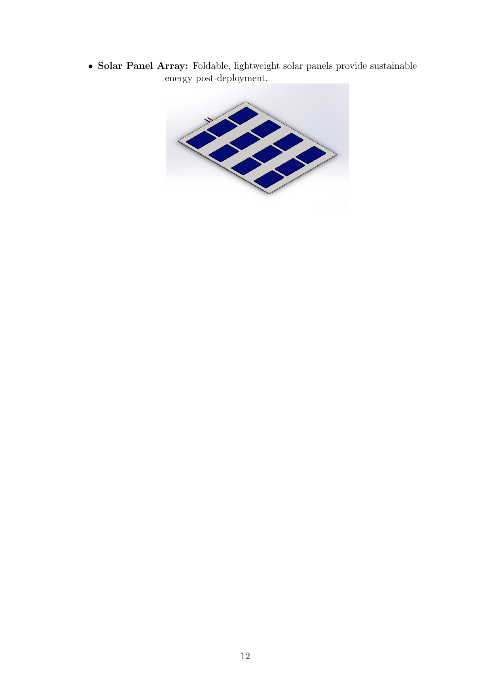
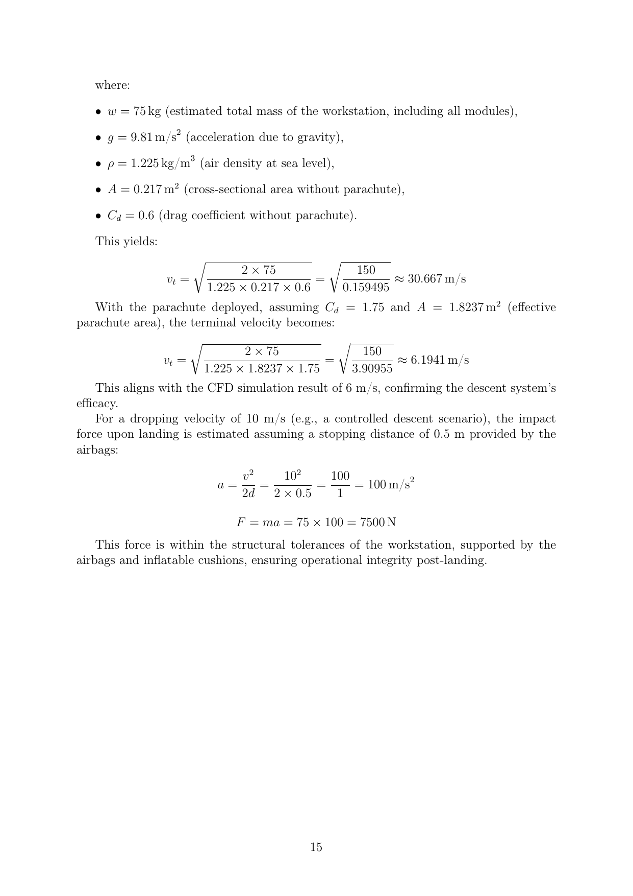
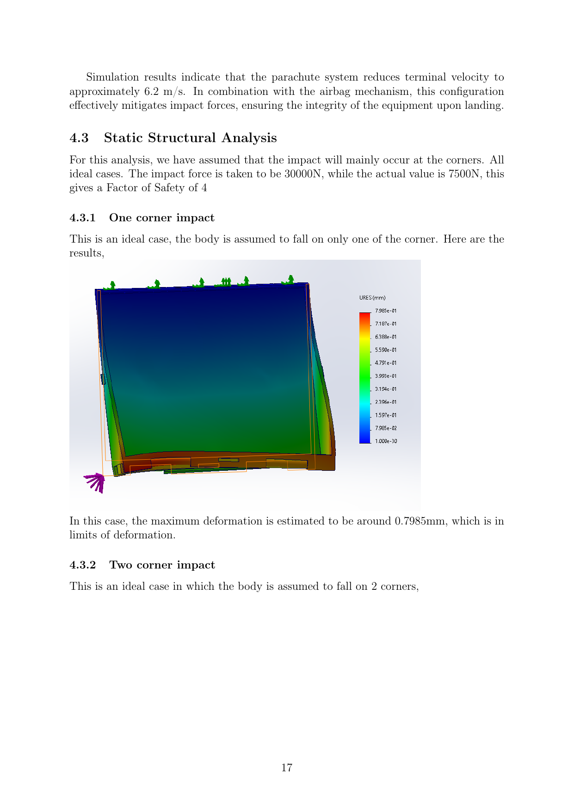

# Smart Modular Workstation for Disaster Relief

Air-droppable, modular field station for disaster response. Submitted to the VYOMA Designathon 2025 (Problem Statement 4), first runner-up.



## What it is

A single droppable unit that gives first responders power, communications, medical supplies, and survival gear in a location with no road access, dropped from an aircraft and slowed down enough to land intact. Designed by a 4-person team (Akula Uday Kiran, Kiran V Airani, Shanthosh K V, Tejas L, RVCE Aerospace Engineering) as a CAD + analysis submission, not a built prototype.

The whole thing is split into four modules stacked into one drop-capable housing:

**Module 1: Power and communication.** LiPo battery pack (3,685-4,914 Wh, ~30.7 kg), Raspberry Pi 5 running an IoT dashboard for power/GPS/occupancy telemetry, a ham radio + antenna for long-range comms, GPS/satellite connectivity, and a hand-crank generator as backup power. Estimated endurance at 100 W average draw: 37-49 hours.

**Module 2: Medical and sustenance.** First-aid stock, dehydrated food rations, and a water purification unit (dry weight ~2.76 kg) for producing potable water in the field.

**Module 3: Survival kit.** Knife, rope (neoprene, 70 g), fire starter, hand warmers, glow sticks, a flare gun, life jackets, masks, and a thermal/IR camera for locating survivors.

**Module 4: Deployment mechanism.** Parachute + airbag system that handles the actual drop, plus the final assembly housing that packages all three modules above.

All parts are modeled as separate SolidWorks components in this repo (`.SLDPRT` / `.SLDASM`), assembled into the final unit shown above.

## Descent and impact analysis

This is the part that's actually engineering, not just packaging. The team had to make sure the workstation survives being dropped from altitude.

**Terminal velocity**, free-fall (no parachute):

```
v_t = sqrt(2mg / (ρ A C_d))
```

with m = 75 kg, ρ = 1.225 kg/m³, A = 0.217 m² (cross-section without parachute), C_d = 0.6:

```
v_t = sqrt(150 / 0.159495) ≈ 30.67 m/s
```

With parachute deployed (A = 1.8237 m² effective canopy area, C_d = 1.75):

```
v_t = sqrt(150 / 3.90955) ≈ 6.19 m/s
```

A CFD simulation of the descent (parachute + payload, velocity field below) came out to ~6 m/s terminal velocity, matching the hand calculation.



**Impact force.** For a 10 m/s touchdown with 0.5 m of airbag stopping distance:

```
a = v² / 2d = 100/1 = 100 m/s²
F = ma = 75 × 100 = 7,500 N
```

The static structural (FEA) runs used a design impact load of 30,000 N (4x the calculated 7,500 N, so factor of safety 4) across three corner-impact cases:

| Case | Max deformation |
|---|---|
| One corner | 0.80 mm |
| Two corners | 1.83 mm |
| All four corners | ~1.0 mm |



All three cases came back within deformation limits, so the housing holds together under the worst-case drop scenario the team modeled.

Full writeup with all module breakdowns, weights, and the complete analysis: [`VYOMA_DESIGNATHON_DOCUMENTATION.pdf`](VYOMA_DESIGNATHON_DOCUMENTATION.pdf). Competition slide deck: [`Vyoma Designathon PPT.pdf`](Vyoma%20Designathon%20PPT.pdf). Descent CFD as a video: [`casing falling cfd.mp4`](casing%20falling%20cfd.mp4).

## What's actually in this repo

Just CAD (SolidWorks `.SLDPRT`/`.SLDASM` for every component and sub-assembly) plus the two PDF reports and the CFD video. There's no analysis code, no scripts, nothing to run, this is a mechanical design submission. Open the parts in SolidWorks (or another STEP-compatible viewer after export) to inspect geometry.

## Limitations

- CAD-only submission, never built or drop-tested as a physical prototype.
- The FEA corner-impact cases are idealized (rigid corner strike, no soil/water compliance, no drop-test correlation).
- Mass and weight figures per component are estimates based on assumed materials (PET plastic, titanium alloy for the flare gun, etc.), not measured.
- No detailed structural design for the parachute risers, airbag inflation system, or release mechanism, those show up as CAD geometry but aren't analyzed.

## Repo note

Several `.SLDPRT` files are large (`FINAL.SLDPRT` and `fianlllll1111.SLDPRT` are ~21 MB each, appear to be duplicate/iteration exports of the same final assembly). Not touched here since it's not clear which is authoritative, worth checking if both are still needed.
